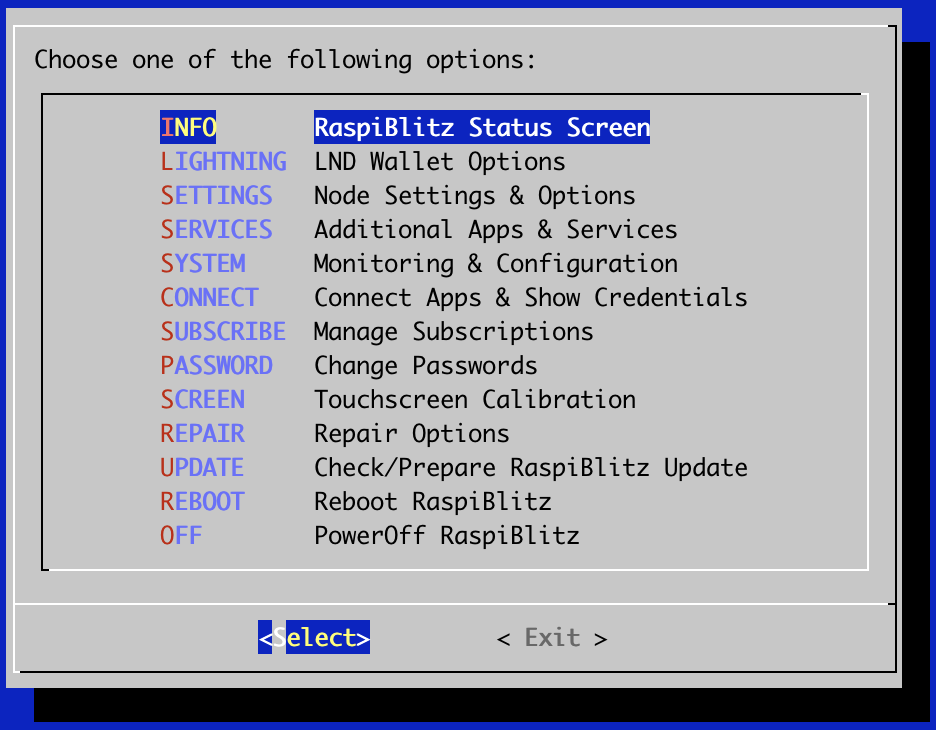
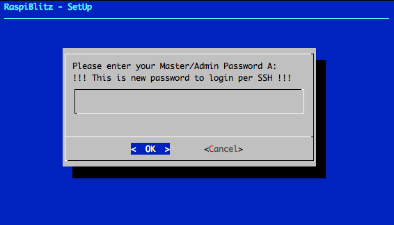
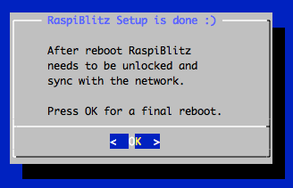
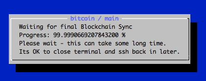
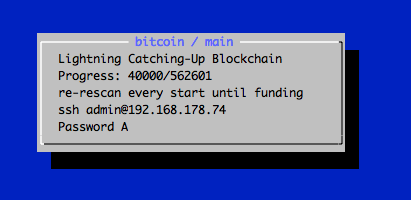

# RaspiBlitz
*Build your own Lightning Node on a RaspberryPi with a nice Display.*

`Version 1.0 with lnd 0.5.2-beta and bitcoin 0.17.0.1 or litecoin 0.16.3.`

**The RaspiBlitz is a all-switches-on Lightning Node based on LND running together with a Bitcoin- or Litecoin-Fullnode on a RaspberryPi3 - with a 1TB HDD and an nice Display for easy setup & monitoring.**

Its mainly targeted for learning how to run your own node decentralized from home. Discover & develop the growing ecosystem of the Lightning Network by becoming a part of it.

## Feature Overview

This is a quick look at the SSH main menu (once RaspiBlitz is SetUp):

There are additional services that can be switched on:

As an parallel alternative to the SSH menu there is also the RTL WebUI available (LND API Coverage at 57%): 

See more details in the [Feature Documentation](#feature-documentation) & of course you have all the [Fullnode APIs](#interface--apis).

## Time Estimate to Setup a RaspiBlitz

The RaspiBlitz is optimized for being setup during a workshop at a hackday or conference. When it comes ready assembled together with a up-to-date synced blockchain its possible to have it ready in about 2 to 3 hours - most is waiting time.

If you start at home ordering the parts from Amazon (see shopping list below) then its a weekend project with a lot of download and syncing time where you can do other stuff while checking on the progress from time to time. 

## Hardware Needed

The RaspiBlitz is build from the following parts:

* RaspBerryPi 3 B+
* Micro SD-Card 16GB
* Strong USB Powersupply >=3A
* 1TB Hard Drive
* Cheap Casing
* LCD-Display

**All together under 150 USD / 130 EUR (depending on country & shop)**

## Amazon Shopping Lists

These are the community currated shopping lists based on country:

* [Germany](shoppinglist_de.md) *(reference shopping list)*
* [USA](shoppinglist_usa.md)
* [UK](shoppinglist_uk.md)
* [Switzerland](shoppinglist_ch.md)
* [France](shoppinglist_fr.md)
* [China](shoppinglist_cn.md)
* [Australia](shoppinglist_au.md)
* [Czech](shoppinglist_cz.md)

*You can even pay your RaspiBlitz Amazon Shopping with Bitcoin & Lightning thru [Bitrefill](https://blog.bitrefill.com/its-here-buy-amazon-vouchers-with-bitcoin-on-bitrefill-bb2a4449724a).*

* [What other case options do I have?](FAQ.md#what-other-case-options-do-i-have)

## Assemble your RaspiBlitz

If your RaspiBlitz is not assembled yet, put the RaspberryPi board into the case and add the display like in picture below:

*Some cases from the shopping lists contain a topping for smaller displays - you can ignore that topping.*

Connect the HDD to one of the USB ports. In the end your RaspiBlitz should look like this:

## Installing the Software

Your SD-card needs to contain the RaspiBlitz software. You can take the long road by [building the SD-card image yourself](#build-the-sd-card-image) or use the already prepared SD-Card image: 

1. Download SD-Card image - **Version 1.0**:
https://wiki.fulmo.org/downloads/raspiblitz-1.00-2019-02-22.img.gz
SHA-256: 91ef1e5b4e55a5a90e9faf094756461be841ba02591bb41ccf481755977b191b

2. Write the SD-Card image to your SD Card - if you need details, see here:
https://www.raspberrypi.org/documentation/installation/installing-images/README.md

## Boot your RaspiBlitz

Insert the SD card and connect the power plug.

* Make sure to connect the raspberry with a LAN cable to the internet at this point.
* Make sure that your laptop and the raspberry are on the same local network.

When everything boots up correctly, you should see the local IP address of your RaspiBlitz on the LCD panel.

So open up a [terminal](https://www.youtube.com/watch?v=5XgBd6rjuDQ) and connect thru SSH with the command displayed by the RaspiBlitz:

`ssh admin@[YOURIP]` → use password: `raspiblitz`

**Now follow the dialoge in your terminal. This can take some time (prepare some coffee) - but in the end you should have a running Lightning node on your RaspberryPi that you can start to learn and hack on.**

## Support

If you run into a problem or you have still a question, follow the steps below to get support. Also check the [setup documentation](#setup-process-detailed-documentation) for details.

1. Lookup the [FAQ](FAQ.md) if you can find an answere to this question/problem.

2. Please determine if your problem/question is about RaspiBlitz or for example with LND. For example if you cant route a payment or get an error when opening a channel that is an LND question/problem an is best answered by the LND dev community: https://dev.lightning.community  

3. Go to the GitHub issues of the RaspiBlitz: https://github.com/rootzoll/raspiblitz/issues Do a search there. Also check closed issues by removing 'is:open' from the filter/search-box.

4. If you havent found an answere yet, open a new issue on the RaspiBlitz GitHub. You may have to register an account with GitHub for this. If its a bug with the RaspiBlitz, please add (copy+paste) a Debug Report to your issue (see [FAQ](FAQ.md) how to generate) and/or add some screenshots/photos so the community gets more insight into your problem.

## Setup Process (Detailed Documentation)

*The goal is, that all information needed is provided from the interaction with the RaspiBlitz itself during the setup. Documentation in this chapter is for background, comments for educators and to mention edge cases.*

### Init

Automatically after login per SSH as admin to the RaspiBlitz, the user can choose if the RaspiBlitz should run Bitcoin or Litecoin with Lightning:

Setting Up the Raspi is the only option at this point, so we go with OK.

*This menu is displayed by the script `00mainMenu.sh` and started automatically on every login of the admin user by admins `.bashrc`. If you want to get to the normal terminal prompt after login, just use CTRL-c or CANCEL. To return to the main menu from the terminal you can use the command `raspiblitz`.*

First thing to setup is giving your RaspiBlitz a name:

This name is given to the RaspiBlitz as hostname in the local network and later on also for the alias of the lightning node.

Then the user gets requested to think of and write down 4 passwords:

*The password A,B,C & D idea is directly based in the [RaspiBolt Guide Preperations](https://github.com/Stadicus/guides/blob/master/raspibolt/raspibolt_20_pi.md#write-down-your-passwords) - check out for more background.*

Then the user is asked to enter the Password A:

This is the new password has to be used for every SSH login after this screen. Its also set for the user existing user: root, bitcoin & pi.

*The bitcoin and lightning services will later run in the background (as daemon) and use the separate user “bitcoin” for security reasons. This user does not have admin rights and cannot change the system configuration.*

Then the user is asked to enter the Password B:

*The other passwords C & D will be needed later on. They will be used during the lightning wallet setup.*

After this the setup process will need some time and the user will see a lot of console outputs:

*Background: After the user interaction the following scripts are started to automatically setup the RaspiBlitz:*

### Getting the Blockchain

*If you have a HDD with a prepared blockchain (e.g. a ready2go-set or you are at a workshop) you can skip to the [next chapter](#setup-lightning). If you started with an empty HDD - you will see the following screen:*

To get a copy of the blockchain, the RaspiBlitz offers the following options:

The options - and when to choose which - will be explained here shortly:

#### 1. Torrent

This is the default way to download the blockchain data for the RaspiBlitz. If you choose it will show you the following screen:

*This can take a while - normally it should be done if you keep it running over night, but some users reported that it took up to 3 days. If it takes longer than that or you cannot see any progress (downloading starting) for over an hour after you started thsi option consider to cancel the download and choose the FTP download option.*

It is safe to close the terminal window (shutdown your laptop) while the RaspiBlitz is doing the torrent download. To check on progress and to continue the setup you need to ssh back in again. 

You can cancel the torrent download by keeping the key `x` pressed. Then the download will stop and you will be asked if you want to keep the progress so far. This makes sense if you need to shutdown the RaspiBlitz and you want to continue later or when you want to try another download option but want to keep the option to continue on torrent if the other option is slower or not working.

* [How can I avoid using a prepared blockchain and validate myself?](FAQ.md#how-can-i-avoid-using-a-prepared-blockchain-and-validate-myself)

#### 2. FTP-Download

You should try the FTP download if the torrent option is not working for you. Please be aware that the files are hosted on a central server by us and up-time and bandwidth is not guaranteed. If you start it, you should see the following screen:

It is safe to close the terminal window (shutdown your laptop) while the RaspiBlitz is doing the FTP download. To check on progress and to continue the setup you need to ssh back in again. 

You can cancel the FTP download by keeping the key `x` pressed. Then the download will stop and you will be asked if you want to keep the progress so far. This makes sense if you need to shutdown the RaspiBlitz and you want to continue later or when you want to try another download option but want to keep the option to continue on FTP download if the other option is slower or not working.

#### 4. Copying from another Computer

If you have another computer available (laptop, desktop or another raspiblitz) that already runs a working blockchain (with txindex=1) you can use this option to copy it over to the RaspiBlitz. This will be done over the local network by SCP (SSH file transfere). Choose this option and follow the given instructions.

This is also the best option if you dont like to run your RaspiBlitz with a prepared blockchain by a third party. Then install bitcoin-core in a more powerful computer, sync+validate the blockchain (with txindex=1) there by yourself and copy it over after that thru the local network.

More details: [I have the full blockchain on another computer. How do I copy it to the RaspiBlitz?](FAQ.md#i-have-the-full-blockchain-on-another-computer-how-do-i-copy-it-to-the-raspiblitz)

#### 5. Cloning from a 2nd HDD

If is a backup way to transfere a blockchain from another computer if copying over the network is not working. More details on the setup can be found [here](FAQ.md#how-do-i-clone-the-blockchain-from-a-2nd-hdd). 

#### 6. Sync from Bitcoin-Network

This is the fallback of last resort. A RaspberryPi has a very low power CPU and syncing+validating the blockchain directly with the peer2peer network can take multiple weeks - thats why the other options above where invented.

### Setup Lightning

Lightning is installed and waiting for your setup if you see this screen.

The RaspiBlitz calling the LND wallet creation command for you:

First it will ask you to set your wallet unlock password - use your choosen PASSWORD C here and confirm it by inputting it a second time. 

Second it will ask you if you have an existing "cipher seed mnemonic" - if this is your first RaspiBlitz/LND just ansere `n`.

*The "cipher seed mnemonic" is the word list that contains the backup of your private key. If you dont have one from a former RaspiBlitz setup it will be created for you. If you want to recovcer on old LND wallet, thats the point in the setup to enter it.*

Third it will ask you if you want to protect your backup word list with an additional password. You can simple keep this empty and just press ENTER to continue. If you want to go for this extra protection use your chossen PASSWORD D here.

LND will now generate a fresh cipher seed (word list) for you. WRITE THIS DOWN before you continue - without you limit your chances to recover funds in case of failing hardware etc. If you just want to try/experiment with the RaspiBlitz at least take a photo with your smartphone just in case. If you might plan to keep your RaspiBlitz running after trying it out store this word list offline or in a password safe. Hit ENTER once your done.

It will now make sure your wallet is initialized correctly and may ask you to unlock it with your just set PASSWORD C.

*The LND wallet needs to get unlocked on every new start/reboot of the RaspiBlitz.*

The RaspiBlitz will now do final setup configuration like installing tools, moving the SWAP file to the HDD or activating the firewall. You will see some text moving across the screen until this screen:

The basic setup is done - hooray ... but still prepare for some long waiting time after this before you can play around with your new RaspiBlitz. Press OK to make a reboot. Your terminal session will get disconnected and the raspberry pi restarts.

### First Start: Syncing & Scanning

After the reboot is done it takes a while for all services to start up - wait until you see on the LCD/display that LND wallet needs to get unlocked. Then SSH in again with the same command like in the beginning (check LCD/display) but this time (and every following login) use your PASSWORD A. 

After terminal login LND will ask you (like on every start/reboot) to unlock the wallet again - use PASSWORD C:

Now on first start you will habe a longer waiting time (between 1 hour and 2-3 days, depending on your initial setup) ... but thats OK, just leave the RaspiBlitz running until its done. You can even close your terminal now and shutdown your laptop and ssh back in later on. You will see on the Blitz LCD/display that it is ready, when the blue backgound screen is gone and you see the status screen like further below.

To understand what is taking so long .. its two things:

1. Blockchain Sync

The blockchain on you HDD is not absolutly up-to-date. Depending how you got it transferred to your RaspiBlitz it will be some hours, days or even weeks behind. Now the RaspiBlitz needs to catch-up the rest by directly syncing with the peer-2-peer network until it reaches almost 100%. But even if you see in the beginning a 99.8% this can take time - gaining 1% can be up to 4 hours (depending on network speed). So be patient here.

2. LND Scanning

Automatically if the Blockchain Sync is done LND will start to scan the blockchain and collect information. If you reached this point it should normally just take around 1 hour until the waiting time is over.

Once all is done you should see this status screen on the RaspiBlitz LCD/display:

### Main Menu

If you now login by SSH in your RaspiBlitz (or you are still logged in) you will the the Main Menu:

And if you scroll down .. you see even more options. All options of the main menu will be explained below in the feature documentation. 

*OK .. so from here on your RaspiBlitz is ready to play with.*

If you need an idea what the most basic next steps to experience Lightning would be:

* Fund on-chain Wallet
* Open a channel
* Make a payment

If you like to do this all from a webbrowser with a dashboard UI instead from an SSH terminal, go to `SERVICES`, activate the `RTL Webinterface` and after the reboot open in your webbrowser: http://[LOCAL-IP-OF-YOU-NODE]:3000 (PASSWORD B is your RPC password).

Have fun and riding the lightning :D

*BTW always love seeing photos of new RaspBlitzes added to the network on twitter @rootzoll*

* [How can I get further help/support?](#support)

### Feature Documentation

These are the features available thru the RaspiBlitz SSH main menu and services. They have the goal to offer some basic/fallback functionality & configurations to you. More complex or user-friendly tasks are best to be done with wallets, apps and scripts you connect to your Lightning Node via [APIs](#interface--apis) - because you have a full Bitcoin- and Lightning-Node on the RaspiBlitz.

So lets take a look at the SSH main menu (3 pages to scroll down):

#### INFO: Raspiblitz Status Screen

This is the screen that gets displayed on the LCD/display. Its useful to call in a remote situation from SSH if you dont have your RaspiBlitz next to you or to make a screenshot.

*Its not automatically updating. Its just for one-time info.*

#### FUNDING: Fund your on-chain Wallet

Before you can open channels with other nodes you need to put some coins onto your LND on-chain wallet. Use this option to generate an address to send funds to.

*Reminder: RaspiBlitz & LND is still experimental software. With funding your LND node you accept the risk of loosing funds. So just play with small amounts - something in then area of 20 EUR/USD should be enough to make your first experiences.*

#### CONNECT: Connect to a Peer

Before you can open a channel with another node on the network you need to connect this node as a peer to your node. 

Opening a channel with a peer is just optional. Having another node a peer helps your node to receive information about the network thru the gossip protocol. It will help your node to find better routes thru the network.

#### CHANNEL: Open a Channel with Peer

To open a payment channel with another node you can use this option.

Find interessting nodes to open channels with on online directories like [1ML.com](https://1ml.com/). 

*This is just a very basic shell script. For more usability try the RTL Webinterface (under Services) or connect a (mobile) wallet with your RaspiBlitz.*

#### SEND: Pay an Invoice/PaymentRequest

Pay an invoice thru lightning.

*This is just a very basic shell script. For more usability try the RTL Webinterface (under Services) or connect a (mobile) wallet with your RaspiBlitz.*

#### RECEIVE: Create Invoice/PaymentRequest

Create an invoice to send to someone or a service to be payed thru lightnig.

*This is just a very basic shell script. For more usability try the RTL Webinterface (under Services) or connect a (mobile) wallet with your RaspiBlitz.*

#### SERVICES: Activate/Deactivate Services

##### Channel Autopilot

The autopilot is a feature of LND that you can switch on. It automatically uses around half of your your on-chain funds (if available) to open channels with other lightning nodes the autopilot thinks can be useful to improve your payment routes.

##### Testnet

You can switch from mainnet to testnet of your blockchain if you want to try things out and play with free test coins.

Please beware that to might take some time to sync the test blockchain and you need to setup a new lnd testnet wallet during the process.

##### DynamicDNS

This is a way to make your RaspiBlitz publicly reachable from the internet so that other nodes can open channels with you and you can connect with your mobile wallet from outside your local network.

To do so you can register at an DynamicDomain service like freedns.afraid.org and forward the TCP ports ...

* 8333 (Bitcoin/mainnet)
* 9735 (LND Node)
* 10009 (LND RPC) 

... from your internet router to the local IP of your RaspiBlitz and then activate unter "Services" the "DynamicDNS" option.

You will be asked for your dynamic domain name such like "mynode.crabdance.org" and you can also optionally set an URL that will be called regularly to update your routers IP with the dynnamic domain service. At freedns.afraid.org this URL is called "Direct URL" under the menu "Dynamic DNS" once you added one.

##### Run behind TOR

You can run your Bitcoin- and Lightning-Node as a TOR hidden service - replacing your IP with an .onion-address

This has some benefits:

* You dont publish your IP running a node so its much harder to resolve your real name and location.
* You tunnel thru the NAT of your router and make Bitcoin and Lightning reachable to all other TOR nodes

But this also comes with the following side effects:

* Mobile wallets dont support connecting over TOR yet
* Lightning nodes that dont run TOR cannot reach you (like behind NAT)

To try it out just switch on the service - you can deactivate later on if its not working for you.

The TOR integration is experimental and at the moment there is no way to switch off TOR again. 

##### RTL Webinterface

The RTL Webinterface is a LND Control Dashboard you can run in your browser with a nice GUI - it offers much more control over your Lightning node than the RaspiBlitu SSH menus. Its recommended to give it a try.

Feedback is welcome by the RTL programmer: https://github.com/ShahanaFarooqui/RTL

##### LND Auto-Unlock

This feature is based on https://github.com/Stadicus/guides/blob/master/raspibolt/raspibolt_6A_auto-unlock.md

It can be activated under "Services" -> "Auto-unlock LND". Its recommended to be turned on, when DynamicDNS is used. Because on a public IP change of your router, LND gets restarted automatically and without Auto-Unlock it will stay inactive/unreachbale until you manually unlock it.

*But keep in mind that when activated, your Password C will be stored on the RaspiBlitz SD card. That lowers your security in (physical) attack scenarios. On an update you would need to re-enter your password C.*

#### MOBILE: Connect Mobile Wallet

This feature should support you in connecting your RaspiBlitz to a mobile wallet on your smartphone.

[mobile](pictures/mainmenu-mobile.png)

At the moment [ZAP (iOS)](https://github.com/LN-Zap/zap-iOS) and [Shango (iOS/Android)](https://github.com/neogeno/shango-lightning-wallet) are available.

Please keep in mind that if you also want to connect to your smartphone also from the outside (thru LTE, 3G, ..) with your RaspiBlitz you might need to open/forward ports on your router and should look into the DynamicDNS features to handle changeing IP of our Home-DSL.

#### EXPORT: Macaroons and TLS.cert

Offers the following options to get the Macaroon and TLS files to be used in other apps and wallets.

*Macaroons: Access Tokens that allow certain command executions on the LND node.*

*TLS: Certificate to secure/encrypt the communication with the LND node.*

[export](pictures/mainmenu-export.png)

##### Hex-String

The Macaroons and TLS.cert files can be copy+pasted as Hex-Strings from RaspiBlitz to any other app that supports that. If you choose this option RaspiBlitz will all files print for you as Hex-String to do so.

This method is recommended to export to:
* [Joule Browser Wallet](https://lightningjoule.com)

##### SSH Download

SCP is a SSH like command to transfer files. If were able to SSH into the RaspiBlitz also the SCP to transfere the files should work. If you choose these option, RaspiBlitz will print prepared SCP commands you can copy+paste to run in a second terminal.

This method is recommended to export to:
* [Zap Desktop Wallet](https://github.com/LN-Zap/zap-desktop)

##### Browserdownload

Opens an ad-hoc webserver so that you can download the files in your local network thru the browser.

*This is a least secure way to transfere those file - everybody in your local network has access to those file during download. Remember with the Admin-Macaroon somebody could takeover your node and spend all your funds. Just use as last fallback.*

##### Renew Macaroons & TLS

Use if you want to invalidate earlier exported Macaroons & TLS files - e.g. lost mobile wallet.

#### NAME: Change Name/Alias of Node

Change the name of your node.

#### PASSWORD: Change Passwords

Change you passwords for security.

#### CHASHOUT: Remove Funds fro, on-chain Wallet

Use if the want to remove all funds from the RaspiBlitz.

#### lnbalance: Detailed Wallet Balances

#### lnchannels: Lightning Channel List

#### OFF: PowerOff RaspiBlitz

A saf way to shutdown the RaspiBlitz. If then a reboot/restart is needed - un/replug the power. 

#### X: Console Terminal

Closes the SSH main menu and exits tothe terminal - where the user can make use of the CLI clients `bitcoin-cli` & `lncli` directly to make use of the Bitcoin- and Lightningnode. 

With the command `raspiblitz` its possible to return to the main menu.

## Interface / APIs

To develop your own scripts/apps and to connect other servcies/apps to your RaspiBlitz you have multiple interfaces/APIs available:

### Bitcoin

* `bitcoin-cli` command line interface on the terminal
* `bitcoind` running on port 8333 (public)
* `JSON-RPC` running on port 8332 (local) [DOC](https://en.bitcoin.it/wiki/API_reference_%28JSON-RPC%29)

### LND-Lightning

* `lncli` command line interface on the terminal [DOC](https://api.lightning.community/)
* `lnd` running on port 9735 (public)
* `gRPC` running on port 10009 (public) [DOC](https://api.lightning.community/)
* `REST` running on port 8080 (public) [DOC](https://api.lightning.community/rest/index.html)

## Updating to new Version

If you have a RaspiBlitz older then verison 0.98 please [see here](FAQ.md).

If you have a RaspiBlitz version 0.98 or newer do the following:

* Main menu > OFF
* Remove power
* Remove SD card

Now download the new RaspiBlitz SD card image and write it to your SD card .. yes you simply overwrite the old one, it's OK, the RaspiBlitz stores all your personal data on the HDD. See details about latest SD card image [here](#installing-the-software).

*If you have done manual changes to the system (installed packages, added scripts, etc) you might need to do some preparations before overwriting your sd card - see [FAQ](FAQ.md#why-do-i-need-to-re-burn-my-sd-card-for-an-update).*

If done successfully, simply put the SD card into the RaspiBlitz and power on again. Then follow the instructions on the display ... and dont worry, you dont need to re-download the blockchain again.

* [Why do I need to re-burn my SD card for an update?](FAQ.md#why-do-i-need-to-re-burn-my-sd-card-for-an-update)

## Build the SD Card Image

A ready to use SD card image of the RaspiBlitz for your RaspberryPi is provided as download by us to get everybody started quickly (see above). But if you want to build that image yourself - here is a quick guide:

* Get a fresh Rasbian RASPBIAN STRETCH WITH DESKTOP card image: [DOWNLOAD](https://www.raspberrypi.org/downloads/raspbian/)
* Write image to a SD card: [TUTORIAL](https://www.raspberrypi.org/documentation/installation/installing-images/README.md) 
* Add a file called `ssh` to the root of the SD card when mounted to enable SSH login
* Start card in Raspi and login per SSH with `ssh pi@[IP-OF-YOUR-RASPI]` password is `raspberry`

Now you are ready to start the SD card build script - copy the following command into your terminal and execute:

`wget https://raw.githubusercontent.com/rootzoll/raspiblitz/master/build_sdcard.sh && sudo bash build_sdcard.sh`

As you can see from the URL you find the build script in this Git repo under `build_sdcard.sh` - there you can check what gets installed and configured in detail. Feel free to post improvements as pull requests.

The whole build process takes a while. At the end the LCD drivers get installed and a reboot is needed. A user `admin` is created during the process. Remember the default password is now `raspiblitz`. You can login per SSH again - this time use admin: `ssh admin@[IP-OF-YOUR-RASPI]`. An installer of the SD card image should automatically launch. If you do not want to continue with the installation at this moment and use this sd card as a template for setting up multiple RaspiBlitze, click `Cancel` and run `/home/admin/XXprepareRelease.sh`. Once you see the LCD going white and the activity LED of the pi starts going dark, you can unplug power and remove the SD card. You have now built your own RaspiBlitz SD card image. 

*Note: If you plan to use your self build sd card as a MASTER copy to backup image and distribute it. Use a smaller 8GB card for that. This way its ensured that it will fit on every 16 GB card recommended for RaspiBlitz later on.*

* [Can I run RaspiBlitz on other computers than RaspberryPi?](FAQ.md#can-i-run-raspiblitz-on-other-computers-than-raspberrypi)
* [How can I build an SD card other then the master branch?](FAQ.md#how-can-i-build-an-sd-card-other-then-the-master-branch)
* [How can I build an SD card from my forked GitHub Repo?](FAQ.md#how-can-i-build-an-sd-card-from-my-forked-github-repo)

## Community Development

Everybody is welcome to join, improve and extend the RaspiBlitz - its a work in progress. [Check the issues](https://github.com/rootzoll/raspiblitz/issues) if you wanna help out or add new ideas. You find the scripts used for RaspiBlitz interactions on the device at `/home/admin` or in this git repo in the subfolder `home.admin`.

Join me on twitter [@rootzoll](https://twitter.com/rootzoll), visit us at a upcomming [#lightninghackday](https://twitter.com/hashtag/LightningHackday?src=hash) or check by on of our bitcoin meetups in Berlin ... every 1st Thursday evening a month at the room77 bar - feel free to buy me a beer with lightning there :)

* [How can I get further help/support?](#support)

IRC channel on Freenode `irc://irc.freenode.net/raspiblitz` (unmoderated)