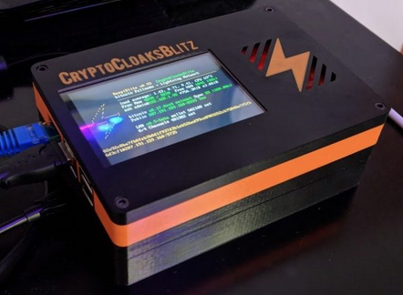
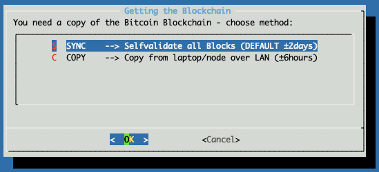
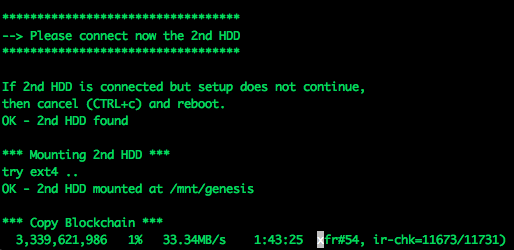
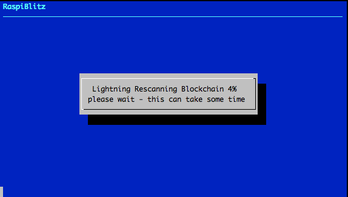
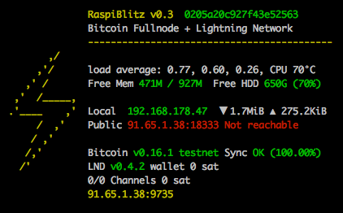
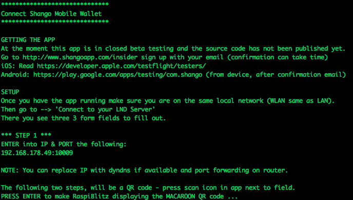

[ [Hardware](#hardware-needed-amazon-shopping-list) ] -- [ [Setup](#boot-your-raspiblitz) ] -- [ [Documentation](#documentation) ] -- [ [Development](#further-development-of-raspiblitz) ]

-----
# RaspiBlitz
Fastest and cheapest way to get your own Lightning Node running - on a RaspberryPi with a nice LCD.

`Version 0.98 (1.0 RC1) with lnd 0.5.1 and bitcoin 0.17.0.1 & litecoin 0.16.3.`

*This tutorial is based on the RaspiBolt project - you can find in detail here: https://github.com/Stadicus/guides/blob/master/raspibolt The RaspiBlitz serves as a shortcut through this setup process with some changes and an additional LCD display so that you can quickly experiment with a Lightning node and start working on your LApps on a hacking event (or at home). This shortcut is fine for testnet usage and maybe trying some small things on mainnet. But if you choose to go full reckless afterwards … please consider taking the time and work thru the original RaspiBolt project. Don’t trust us, verify.*

## Table of Contents

* [ [Hardware](#hardware-needed-amazon-shopping-list) ] Shopping Lists and Putting all together  
* [ [Setup](#boot-your-raspiblitz) ] Init and Setup your RaspiBlitz Lightning Node
* [ [Documentation](#documentation) ] Features and Usecases  
* [ [Development](#further-development-of-raspiblitz) ] Lets work together on the RaspiBlitz

## Hardware Needed (Amazon Shopping List)

*The RaspiBlitz software is build and tested for the following Hardware set that you can buy cheap on GERMAN Amazon:*

* RaspBerry Pi 3 (34,99 EUR) https://www.amazon.de/dp/B07BDR5PDW
* Micro SD-Card 16GB (7,99 EUR) https://www.amazon.de/gp/product/B073K14CVB/
* Power >=3A (9,91 EUR) https://www.amazon.de/dp/B01E75SB2C
* 1TB Hard Drive (44,98 EUR) https://www.amazon.de/dp/B07997KKSK?th=1
* Case (9,36 EUR) https://www.amazon.de/dp/B0173GQF8Y
* LCD-Display (16,88 EUR) https://www.amazon.de/gp/product/B06X191RX7

**Total Price: 124,11 EUR** (thats under 150 USD)

Amazon shopping lists for different countries:
[ [USA](shoppinglist_usa.md) ] [ [UK](shoppinglist_uk.md) ] [ [France](shoppinglist_fr.md) ] [ [China](shoppinglist_cn.md) ] [ [Australia](shoppinglist_au.md) ] [ [Czech](shoppinglist_cz.md) ]

You can even pay your RaspiBlitz Amazon Shopping with Bitcoin & Lightning thru [Bitrefill](https://blog.bitrefill.com/its-here-buy-amazon-vouchers-with-bitcoin-on-bitrefill-bb2a4449724a).

The shopping list for China refers to Taobao/T-Mall.

### 3D Printed Case (optional)

You can replace the generic case in the shopping lists above with a customized 3D printed for the RaspiBlitz called "Lightning Shell" - great work by @CryptoCloaks

https://thecryptocloak.com/product/lightningshell/

### More optional Hardware

*Some optional goodies to consider to add to your shopping list for your RaspiBlitz (Amazon DE/US):*

* SD-Card Writer https://www.amazon.de/dp/B01JWFZWUQ / http://a.co/6e03D7Z
* LAN Cable https://www.amazon.de/dp/B004SUEIE2 /http://a.co/g2IJd6i
* USB-LAN-Adapter https://www.amazon.de/dp/B00NPJV4YY / http://a.co/ccb26nF
* Transport Case https://www.amazon.de/dp/B007Y4NWSW / http://a.co/0c6wyM2
* Y-Cable https://www.amazon.de/dp/B00ZJBIHVY / http://a.co/0WTA7nz

If you organizing an educational event where you want to support people learning on and with multiple RaspiBlitz, here is a package list of useful hardware to have at that event: [ [Event Package List](shoppinglist_event.md) ]

## Prepare your Hardware

*There are two ways to start:*

### Scenario 1: “At a Hackathon/Event”
If you are at an event, ask for a ready-2-go set or if you have your own hardware ask for assistance to prepare your SD-Card and HDD. Then you are all set and and you can proceed with "Setup your RaspiBlitz".

### Scenario 2 “Start at Home”
You got all the hardware of the shopping list above and you have no further assistance. Then you need to prepare your SD-Card yourself .. this scenario is still experimental, feedback needed and can take some time.

1. Download SD-Card image:
https://wiki.fulmo.org/downloads/raspiblitz-0.98-2018-12-20.img.gz
SHA-256: 746ee516d37d1a2e25a65eff87c7907597ac2a386ed2c1580e8b993fc33819cc
or [build your own SD card image](#build-the-sd-card-image)

2. Write the SD-Card image to your SD Card - if you need details, see here:
https://www.raspberrypi.org/documentation/installation/installing-images/README.md

## Boot your RaspiBlitz

Connect all hardware like on photo and boot it up by connecting the power.

* Make sure to connect the raspberry with a LAN cable to the internet at this point.
* Make sure that your laptop and the raspberry are on the same local network.
* On Mac OS X you can also consider to connect the raspberry directly with your laptop and share your WLAN internet connection over ethernet (thats a nice mobile setup): https://mycyberuniverse.com/mac-os/connect-to-raspberry-pi-from-a-mac-using-ethernet.html

When everything boots up correctly, you should see the local IP address of your RaspiBlitz on the LCD panel.

So open up a [terminal](https://www.youtube.com/watch?v=5XgBd6rjuDQ) and connect thru SSH with the command displayed by the RaspiBlitz:

`ssh admin@[YOURIP]` → use password: `raspiblitz`

**Now follow the dialoge in your terminal. This can take some time (prepare some coffee) - but in the end you should have a running Lightning node on your RaspberryPi that you can start to learn and hack on.**

## Documentation

### Setup Process

*The goal is, that all information needed is provided from the interaction with the RaspiBlitz itself during the setup. Documentation in this chapter is for background, comments for educators and help in special edge cases.*

#### Init

Automatically after login per SSH as admin to the RaspiBlitz, the user can choose if the RaspiBlitz should combine Bitcoin or Litecoin with Lightning:

Setting Up the Raspi is the only option at this point, so we go with OK.

*Background: This menu is displayed by the script `00mainMenu.sh` and started automatically on every login of the admin user by admins `.bashrc`. If you want to get to the normal terminal prompt after login, just use CTRL-c. If you press OK in the dialog the script `10setupBlitz.sh` gets started*

First thing to setup is giving your RaspiBlitz an name:

This name is given to the RaspiBlitz as hostname in the local network and later on also for the alias of the lightning node.

*Background: This and the following setup dialogues are part of the script `20setupDialog.sh`. The idea is to request much as needed setup information from the user at the start in this dialogs, so after that the setup can just run without many breaks.*

Then the user gets requested to write down 4 passwords:

*Background: The password A,B,C & D idea is directly based in the [RaspiBolt Guide Preperations](https://github.com/Stadicus/guides/blob/master/raspibolt/raspibolt_20_pi.md#write-down-your-passwords)*

Then the user is asked to enter the Password A:

On the next SSH login to the RaspiBlitz as admin, this new password has to be used. Its also set for the user existing user: root, bitcoin & pi. But only admin can be used to login per SSH.

*Background: The bitcoin and lightning processes will run in the background (as daemon) and use the separate user “bitcoin” for security reasons. This user does not have admin rights and cannot change the system configuration.*

Then the user is asked to enter the Password B:

*Background: The other passwords C & D get entered by the lightning wallet setup. This can just happen later ... so they will not get requested at this point.*

After this the setup process needs some time and the user will see a lot of console outputs:

*Background: After the user interaction the following scripts are started to automatically setup the RaspiBlitz:*

* 30initHDD.sh - it checks if the HDD needs to be formatted with Ext4
* 40addHDD.sh - adds the HDD for permanent mounting on /mnt/hdd
* 10setupBlitz.sh - now takes care that the HDD contains the blockchain

The following screen is just shown, if the HDD was not prepared with a copy of the Bitcoin blockchain (as part of a ready-2-go set). The following options are offered to get a copy:

The option "SYNC" should just be use as a fallback. So normally you have the following two options:

#### Download the Blockchain

This is the recommended way for users that are making the setup at home without any further assistance but can take quite some time. You can choose to download over TORRENT or FTP-DOWNLOAD. Choose the FTP if the torrent is not working for you.

For more details: [Background on Download Blockchain](background_downloadBlockchain.md)

#### Copy the Blockchain

To copy the blockchain from another HDD can be faster - if available. If you choose this option, the console requests you to connect the second HDD and will autmatically detect it:

You can simply use the HDD of another RaspiBlitz or you prepare a HDD yourself by:

* format second HDD with exFAT (availbale on Windows and Mac)
* copy an indexed Blockchain into the root folder "bitcoin"
* when youre HDD is ready the content of your folder bitcoin should look like this:

To connect the 2nd HDD to the RaspiBlitz, the use of a Y cable to provide extra power is recommended (see optional shopping list). Because the RaspiBlitz cannot run 2 HDDs without extra power. For extra power you can use a battery pack, like in this picture:

**Background: If the blockchain was already on the HDD or was acquired successfully, the script `60finishHDD.sh` will be called. It will further prepare the HDD and start the bitcoin service.*

#### Lightning

Before the lighting service can be started, the Bitcoin service needs to make sure that the blockchain is up to date. The downloaded blockchain data could be several weeks old - this could take some minutes. Then the Lightning Service gets started and a wallet can be created:

The creation of the Lightning Bitcoin Wallet gets done with the command: `lncli create` the RaspiBlitz is calling in the background.

After the wallet was created the Lightning service needs to scan the Blockchain ... this can take some time. If needed the user can close the SSH session with the RaspiBlitz during that time (progress is displayed on the LCD as status). On SSH back in just continue with the setup process.

*Background: Blockchain synup, LND wallet creation and LND scanning is all done within the script `70initLND.sh`*

Now the setup process is almost done and the RaspiBlitz needs a reboot:

After reboot the RaspiBlitz is showing that the Wallet needs to be unlocked on the LCD and its ready to SSH back in:

*Background: The LND wallet needs to get unlocked on every new start of the RaspiBlitz. The status information loop on the LCD is done by the script '00infoBlitz.sh'*

After SSH back in as admin the main menu shows the unlock option:

Once the wallet is unlocked the setup is finally over and the main menu shows the option and features of the RaspiBlitz:

And if you scroll down .. you see even more feature options:

*Background: The script `00mainMenu.sh` is now the place to offer further features und extend the possibilities of the RaspiBlitz. Feel free to come up with ideas. Check out the developer section at the end of this page.*

### Features

You can manually extend your RaspiBlitz with features listed in the RaspiBolt Guide: https://github.com/Stadicus/guides/blob/master/raspibolt/raspibolt_60_bonus.md

Already integrated features of the RaspiBlitz are/will be listed as part of the main menu after connecting via ssh as admin user.

*Background: The script `91addBonus.sh` is the place to put your setup of features you want to add to RaspiBlitz. Its run at the end of the automated setup process before final reboot. To make the feature executable for the user, add a new option to the `00mainMenu.sh`*

#### Status Infoscreen

#### Detailed Balances and Channel Info

#### TOR Integration (experimental)

You can use the Switch to TOR option from the main menu to make the node reachable thru TOR. This way you can get thru a NAT without needed to open/forward ports on your router. Bitcoin and LND will have a seperate onion-address displayed on LCD and the Status Info Screen option in menu.

The TOR integration is experimental and at the moment there is no way to switch off TOR again. 

#### Connect to Mobile Wallet

There is now the option to connect and control your LND node with the mobile app called "Shango" - choose option in the main menu.

#### RaspiBlitz as Backend for BTCPayServer (experimental)

BTCPay Server is a solution to be your own payment processor to accept Lightning Payments for your online store: https://github.com/btcpayserver/btcpayserver 

You can find setup instructions here: https://goo.gl/KnTzLu

Thanks to @RobEdb (ask on twitter for more details) running his demo store with RaspiBlitz: https://store.edberg.eu - buy a picture of [him and Andreas](https://store.edberg.eu/produkt/jag-andreas/) :)

#### Public Domain with DynamicDNS

This is a way to make your RaspiBlitz publicly reachable from the internet so that other nodes can open channels with you and you can connect with the 

To do so you can register at an DynamicDomain service like freedns.afraid.org, forward the TCP ports 8333 (Bitcoin/mainnet),9735 (LND Node) & 10009 (LND RPC) from your internet router to the local IP of your RaspiBlitz and then activate unter "Services" the "DynamicDNS" option.

You will be asked for your dynamic domain name such like "mynode.crabdance.org" and you can also optionally set an URL that will be called regularly to update your routers IP with the dynnamic domain service. At freedns.afraid.org this URL is called "Direct URL" under the menu "Dynamic DNS" once you added one.

## Get a Debug Report

If your RaspiBlitz is not working right and you like to get help from the community, its good to provide more debug information, so other can better diagnose your problem - please follow the following steps to generate a debug report:

- ssh into your raspiblitz as admin user with your password A
- If you see the menu - use CTRL+C to get to the terminal
- If your RaspiBlitz is lower then version 0.96 then run: `./XXupdateScripts.sh` first
- To generate debug report run: `./XXdebugLogs.sh`
- Then copy all output beginning with `*** RASPIBLITZ LOGS ***` and share this

PLEASE NOTICE: Its possible that this logs can contain private information (like IPs, node IDs, ...) - just share publicly what you feel OK with.

## Build the SD Card Image

A ready to use SD card image of the RaspiBlitz for your RaspberryPi is provided as download by us to get everybody started quickly. But if you want to build that image yourself - here is a quick guide:

* Get a fresh Rasbian RASPBIAN STRETCH WITH DESKTOP card image: [DOWNLOAD](https://www.raspberrypi.org/downloads/raspbian/)
* Write image to a SD card: [TUTORIAL](https://www.raspberrypi.org/documentation/installation/installing-images/README.md) 
* Add a file called `ssh` to the root of the SD card when mounted to enable SSH login
* Start card in Raspi and login per SSH with `ssh pi@[IP-OF-YOUR-RASPI]` password is `raspberry`

Now you are ready to start the SD card build script - copy the following command into your terminal and execute:

`wget https://raw.githubusercontent.com/rootzoll/raspiblitz/master/build.sdcard/raspbianStretchDesktop.sh && sudo bash raspbianStretchDesktop.sh`

As you can see from the URL you find the build script in this Git repo under `build.sdcard/raspbianStretchDesktop.sh`- there you can check what gets installed and configured in detail. Feel free to post improvements as pull requests.

The whole build process takes a while. At the end the LCD drivers get installed and a reboot is needed. A user `admin` is created during the process. Remember the default password is now `raspiblitz`. You can login per SSH again - this time use admin: `ssh admin@[IP-OF-YOUR-RASPI]`. An installer of the SD card image should automatically launch. If you do not want to continue with the installation at this moment, click `Cancel` and simply shutdown with `sudo shutdown now`. Once you see the LCD going white and the activity LED of the pi starts going dark, you can unplug power and remove the SD card. You have now built your own RaspiBlitz SD card image. 

*Note: If you plan to use your self build sd card as a MASTER copy to backup image and distribute it. Use a smaller 8GB card for that. This way its ensured that it will fit on every 16 GB card recommended for RaspiBlitz later on.*

And if you are a developer - to build a sd card from the dev-branch use this command to execute:

`wget https://raw.githubusercontent.com/rootzoll/raspiblitz/dev/build.sdcard/raspbianStretchDesktop.sh && sudo bash raspbianStretchDesktop.sh 'dev'`

## Update to a new SD Card Release

At the beginning of this README you can find the newest SD card we provide. Or you can build the newest SD card image yourself like in the chapter above. The SD card image is used to setup a fresh install of the RaspiBlitz. So what to do if you already have an older version running and you want to upgrade?

Until we reach version 1.0 the update process will be a bit rough .. so what you do is:
* close all open lightning channels you have (`lncli closeallchannels --force`)
* wait until all closing transactions are done
* move all on-chain funds to a wallet outside raspiblitz (`lncli --conf_target 3 sendcoins [ADDRESS]`)
* run the script `./XXcleanHDD.sh` in admin home directory (Blockchain will stay on HDD)
* shutdown RaspiBlitz (`sudo shutdown now`)
* flash SD card with new image
* Redo a fresh setup of RaspiBlitz
* Move your funds back in
* Re-Open your channels

We know that this is not optimal yet. But until version 1.0 we will change too much stuff to garantue any other save update mechanism. Also by redoing all the setup you help out on testing the lastest setup process.

From the upcomming version 1.0 onwards the goal is to make it easier to keep up with the lastest RaspiBlitz updates.

## Recover your Coins from a failing RaspiBlitz

You might run into a situation where your hardware fails or the software starts to act buggy. So you decide to setup a fresh RaspiBlitz, like in the chapter above "Update to a new SD Card Release" - but the closing channels and cashing out is not working anymore. So whats about the funds you already have on your failing setup?

There is not a perfect way yet to backup/recover your coins, but you can try the following to make the best out of the situation:

### 1) Recover from Wallet Seed

Remember those 24 words you were writing down during the setup? Thats your "cipher seed" - now this words are important to recover your wallet. If you dont have them anymore: skip this chapter and read option 2. If you still have the cypher seed: good, but read the following carefully:

With the cypher seed you can recover the bitcoin wallet that LND was managing for you - but it does not contain all the details about the channels you have open - its just the key to your funding wallet. If you were able to close all channels or never opened any channels, then everything is OK and you can go on. If you had open channels with funds in there, the following is to consider:

* You now rely on your channel counter parts to force close the channel at one point. If they do, the coins will be available to use in your funding wallet again at one point in the future - after force close delay.
* If your channel counter parts never force close the channel (because they are offline too) your channel funds can be frozen forever.

So going this way there is a small risk, that you will not recover your funds. But normally if your channel counter parts are still online, see that you will not come back online and they have themselves some funds on their channel side with you: They have an incentive to force close the channel to make use of their funds again.

So here is what todo if you want to "Recover from Wallet Seed" with RaspiBlitz:

- SetUp a fresh RaspiBlitz (fresh SD-Card image and clean HDD).
- During the new SetUp you get to the point of creating the LND wallet (see image below).
- When you get asked "do you have an existing cypher wallet" answere `y` this time.
- Follow the dialog and enter the cypher seed.
- If you get asked at the end for the password D to encrypt your cypher seed, use the same as the last time. If you havent entered one last time, just press Enter again.

Then give LND some time to rescan the blockchain. In the end you will have restored your funding wallet. You maybe need to wait for your old channel counter parts to force close the old channels until you see the coins back displayed.

### 2) LND Channel State Backup

This second option is very very risky and can lead to complete loss of funds. And it olny can work, if you can still access the HDD content of your failing RaspiBlitz. It should only be used if you lost your cypher seed for the option above, forgot your cypher seed encryption password or your old channel counter parts are offline, too.

What you do is in priciple:
- Make a copy of the HDD directory "/mnt/hdd/lnd"
- Setup a fresh RaspiBlitz
- Stop LND
- Replace the new "/mnt/hdd/lnd" with your backuped version
- Reboot the RaspiBlitz

This is highly experimental. And again: If you restore the LND with an backup that is not representing the latest channel state, this will trigger the lightning "penalty" mechanism - allowing your channel counter part to grab all the funds from a channel. Its a measure of last resort. But if its working for you, let us know.

## Mobile Development: Connect RaspiBlitz without a Router/Switch

To connect a RaspiBlitz directly (without a router/switch) to your laptop and share the WIFI internet connection, you can follow this [guide for OSX](https://medium.com/@tzhenghao/how-to-ssh-into-your-raspberry-pi-with-a-mac-and-ethernet-cable-636a197d055). In short:

* connect with LAN directly
* Settings > Sharing/Freigaben > activate "internet sharing" from WLAN to Ethernet
* Settings > Network > Ethernet-Adapter > set to DHCP
* in terminal > `ifconfig` there you should the the IP of the bridge100
* in terminal > `arp -a` and check for an IP of a client to the bridge
* in terminal > ssh admin@[clientIP] 

## Further Development of RaspiBlitz

The RaspiBlitz was developed on the basis of the RaspiBolt Guide to run LND on a RaspberryPi: https://github.com/Stadicus/guides/blob/master/raspibolt - the idea was to prepare as much as possible and have it on a SD-card ready to startup quickly. The configuration should be automated by scripts combined with some very basic user interaction thru the terminal for adminstration. The LCD should provide basic information, so that the health and state of the RaspiBlitz could be monitored with ease. The LCD has also basic touch support and could be used for direct and fast daily interactions.

The goal of the RaspiBlitz is to provide a out-of-the-box hardware lightning node to learn the basics of being part of the decentralized network and to quickly start building your own applications based on lightning (LApps) - at home or at educational/hacking events. With the well known [GPIO-Pins](https://www.raspberrypi.org/documentation/usage/gpio/) of the RaspberryPi, low-cost entry point and its rich hardware extension ecosystem it seems like the perfect device to foster the communities creativity. Lets keep crypto weird.

Everybody is welcome to join, improve and extend the RaspiBlitz - its a work in progress. Check the issues if you wanna help out or add new ideas. You find the scripts used for RaspiBlitz interactions on the device at `/home/admin` or in this git repo in the subfolder `home.admin`. More to come.

Join me on twitter [@rootzoll](https://twitter.com/rootzoll), visit us at a [#lightninghackday](https://twitter.com/hashtag/LightningHackday?src=hash) in Berlin or drop by the Bitcoin Assembly at the [#35C3](https://twitter.com/hashtag/35C3).

IRC channel on Freenode `irc://irc.freenode.net/raspiblitz` (unmoderated)
