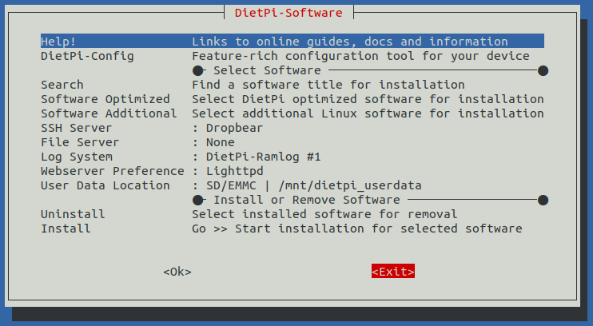

# ⚡️ RaspiBlitz on DietPi ⚡️
#  A hardware agnostic platform

This guide was tested on:

* Odroid HC1
* Odroid HC2 (the same board except it accommodates a 3.5" 12V HDD)
* Raspberry Pi 3 B Plus - no LCD support so far
* hoping to extend this list with more compatible boards especially the ROCK64  

See the hardware specs:  [hardware specs](hw_comparison.md).

## Download the fully prebuilt RaspiBlitz on DietPi SDcard image

for the Odroid HC1 / HC2 / XU3 / XU4 from this [torrent](https://github.com/openoms/raspiblitz/blob/raspiblitz-dev/dietpi/RaspiBlitz1.0_OdroidHC1_DietPi6.21.1.torrent) or from [mega.nz](https://mega.nz/#F!EVNAAQiB!ZyLHP2dJMRSVjZOTCQMIYA).  
(sha256sum RaspiBlitz1.0_OdroidHC1_DietPi6.21.1.img: 
96ee8700f52a12fb5b13fab3fffcdcf5d364c6dd16c580d969e421cef2cd7cc2)

Steps to run:
- download the .img file,
- burn to a 16 GB SD with [Etcher](https://www.balena.io/etcher/)
- extend the rootFS partition with a partition manager (disks, Gparted, etc.)
- boot the Odroid with the SDcard and login with ssh admin@at.your.raspiblitz.ip, password: raspiblitz

Using this image you can skip the rest of this guide as it is mostly about how this image was built.

The setup continues with the [RaspiBlitz Setup Process](https://github.com/rootzoll/raspiblitz/blob/master/README.md#setup-process-detailed-documentation)

---
## Setting up the DietPi OS

### Download the updated DietPi image

For the Odroid HC1 / HC2 / XU3 / XU4 a v6.20.6 DietPi image with fail2ban installed is uploaded [here](
https://mega.nz/#!AcdVBAbR!O-W3jP5LUgw7lMY8S9XcBWcKX3IhRNAAFmaYzDXIUC0). (sha256sum DietPi_v6.20.6_OdroidXU4-ARMv7-Stretch.img: 
1459b91f66b9db98f3437c31231e44497b7b7dcd9146d2cc41a3da653f9a9215)

Burn to the SDCard with [Etcher](https://www.balena.io/etcher/) and extend the rootfs partition to the size of your card with a partition manager.

Insert the SDcard into the Odroid.

Power up and continue with: [Run the DietPi optimized Raspiblitz SDcard build script](#Run-the-RaspiBlitz-build_sdcard.sh-script)

### Build your own DietPi image:

Watch out this an ardous process. 
Updating from a v6.14 DietPi image is causing a bootloop under some circumstances. Will be sorted once the current, >6.2 version is uploaded for the Odroids.  

For the Odroid HC1 / HC2 / XU3 / XU4 the start is this image:   
https://dietpi.com/downloads/images/DietPi_OdroidXU4-ARMv7-Stretch.7z  
Burn it to the SD with [Etcher](https://www.balena.io/etcher/)

Getting started with DietPi: https://dietpi.com/phpbb/viewtopic.php?f=8&t=9#p9  

In the desktop terminal on Linux / MacOS or Putty on Windows:  

`ssh root@[IP-OF-DIETPI]`  
password: `dietpi`  

Ok > Cancel > Cancel  
automatic apt update & apt upgrade and asks to reboot
  

`ssh root@[IP-OF-DIETPI]`  
after the previous update the ssh keys might change:

@@@@@@@@@@@@@@@@@@@@@@@@@@@@@@@  
@ WARNING: REMOTE HOST IDENTIFICATION HAS CHANGED! @  
@@@@@@@@@@@@@@@@@@@@@@@@@@@@@@@  

run (can be copied from the terminal output):   
`ssh-keygen -f "/home/[your-linux-username]/.ssh/known_hosts" -R "dietpi.IP"`

`ssh root@[IP-OF-DIETPI]`   
yes >   
password: `dietpi`  

At this point if the DietPi was not updated from 6.14 it does not manage to save settings going forward.  
Exit the sotware installer (press Tab to jump to Exit)
  

in the bash prompt run:  
`dietpi-update`
>Ok > Cancel the recovery point   
update > >Opt out of survey > Ok  
Reboots

`ssh root@[IP-OF-DIETPI]`  
password: `dietpi` 

>Ok > Cancel > Cancel  
Search `fail2ban` > Space to select > Enter  
SSH server > switch from Dropbear to the OpenSSH-server  
> Install > Ok  
>Opt out of survey > Ok  
Reboots again

Changing the SSH server will change the SSH keys again. To clear:  
`ssh-keygen -f "/home/[your-linux-username]/.ssh/known_hosts" -R "dietpi.IP"`

## Run the RaspiBlitz build_sdcard.sh script

In the desktop terminal in Linux / MacOS or Putty in Windows:

`ssh root@[IP-OF-DIETPI]`  
password: `dietpi`  
Should end up here on version v6.20.6 or higher: 

run the build_sdcard.sh script in this format:
`wget https://raw.githubusercontent.com/[GITHUB-USERNAME]/raspiblitz/[BRANCH]/build_sdcard.sh && sudo bash build_sdcard.sh [BRANCH] [GITHUB-USERNAME]`

Be aware of that the fork needs to be called `raspiblitz` for the git download to work.
if you intend to use @openoms`s forked version:

`wget https://raw.githubusercontent.com/openoms/raspiblitz/raspiblitz-dev/build_sdcard.sh && sudo bash build_sdcard.sh raspiblitz-dev openoms`

`ssh admin@[IP-OF-DROIDBLITZ]`  
password: raspiblitz

The setup continues with the [RaspiBlitz Setup Process](https://github.com/rootzoll/raspiblitz/blob/master/README.md#setup-process-detailed-documentation)

---
### Examples of copying the blockchain data from a HDD using a powered USB to SATA adapter

---
### Useful commands for debugging:
To test a new configuration run XXcleanHDD.sh and strictly restart
(this makes _bootstrap.sh and 00mainMenu.sh run in the right order)

`tail -n1000 -f /var/tmp/dietpi/logs/dietpi-automation_custom_script.log` follow startup setup script log  
`lsblk` see the partitions  
`tail -n1000 -f raspiblitz.log` - debug logs of bootstrap.sh  
`sudo tail -f /mnt/hdd/bitcoin/debug.log` - continuous monitoring  
`sudo tail -n100 /mnt/hdd/bitcoin/debug.log` - shows the last 100 lines  
`sudo systemctl status lnd`  
`sudo journalctl -f -u lnd`  
`./home/admin/XXdebugLogs.sh` - debug log collection on the raspiblitz 

---

## Excerpts from the default [dietpi.txt](https://github.com/Fourdee/DietPi/blob/master/dietpi.txt)
to be used for a fully automatic SDcard building process.

### Automate installation with the dietpi.txt
Need to copy to SDcard /boot/dietpi.txt after burning the image with Etcher.
IMPORTANT:
- Modifications to /boot/dietpi.txt will not be preserved on reboot.
- Please ensure you edit from the DietPi-RAMdisk location: /DietPi/dietpi.txt
NB: This is intended for advanced users, unless you know what you are doing, do not edit this file. ease use the DietPi programs instead.
NB: Do not remove uncommented lines, as the items are scraped by DietPi programs, on demand.
DietPi-Automation settings, applied on the 1st boot of DietPi, ONCE
Sample:
https://github.com/Fourdee/DietPi/blob/master/dietpi.txt

### DietPi-Software to automatically install.  
Requires `AUTO_SETUP_AUTOMATED=1  `
For a list of software index's (ID's), run '/DietPi/dietpi/dietpi-software list'  
No limit on number entries, add as many as you need and uncomment the line.  
DietPi will automatically install all pre-reqs (eg: ALSA/XSERVER for desktops etc)  
>install fail2ban  
AUTO_SETUP_INSTALL_SOFTWARE_ID=73  
install OpenSSH Client  
AUTO_SETUP_INSTALL_SOFTWARE_ID=0  
install OpenSSH Server  
AUTO_SETUP_INSTALL_SOFTWARE_ID=105  

### Custom Script (post-networking and post-DietPi install) 
Runs after DietPi installation is completed
Allows you to automatically execute a custom script at the end of DietPi installation.  
Option 1 = Copy your script to /boot/Automation_Custom_Script.sh and it will be executed automatically.  
Option 2 = Host your script online, then use AUTO_SETUP_CUSTOM_SCRIPT_EXEC=http://myweb.com/myscript.sh, it will be downloaded and executed automatically. | 0=disabled  
NB: Executed script log /var/tmp/dietpi/logs/dietpi-automation_custom_script.log

### Guide to clone your SD-cards in Windows, MacOS and Linux and shrink the image in Linux:
https://beebom.com/how-clone-raspberry-pi-sd-card-windows-linux-macos/